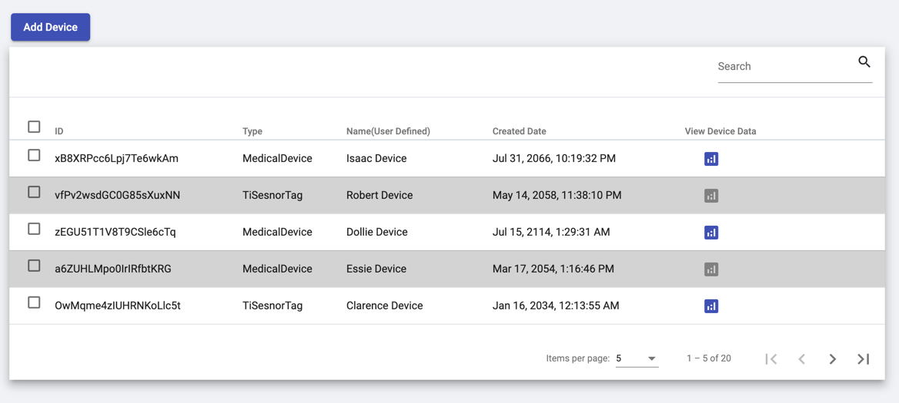
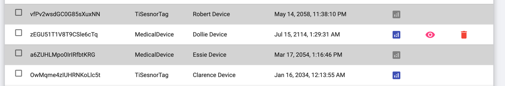
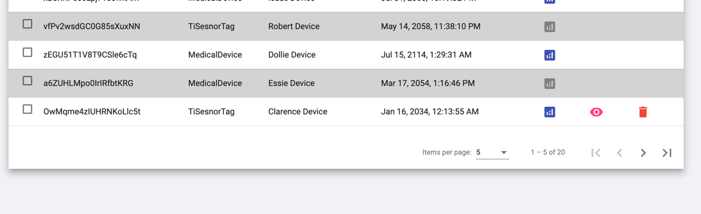

# Data Table

It's a common module which can be used in any way All the Columns and Rows and heading names all are configurable

* Showing list of Devices with all the details

* On hover of the each row more options configured to that table will be displayed

* Disabled Devices will be greyed out
* Paginations and Search will hit an API call to fetch and load devices in real-time
