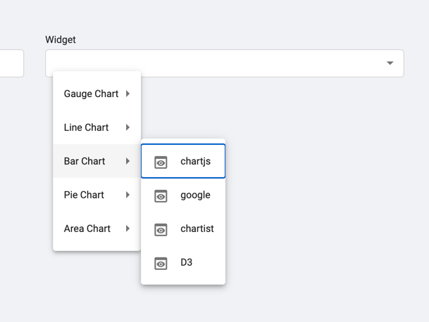

# Dash board Module

> Images are just placeholders will be replaced with instructive SVG files later

* When Dashboard is Empty

* Adding New Dashboard Popup 

After creating new Dashboard it will be rredirected to Add Widget Form

* Adding New Widget Form

* Selecting Widget with preferred Third Party library

* Device Specific Configuration form with custom form realted to that widget

* Dashboard View with 1 widget

* Fab Icon to add a new widget to dashboard

* Draggable and adjustable Dashboard UI

