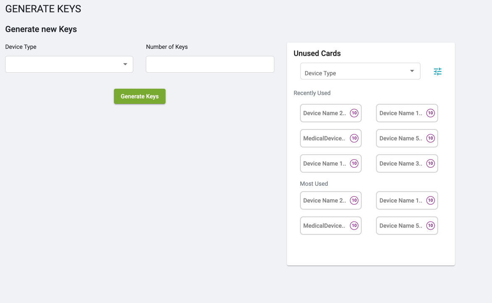
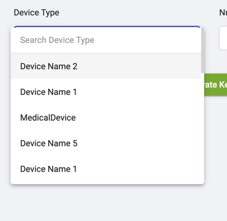
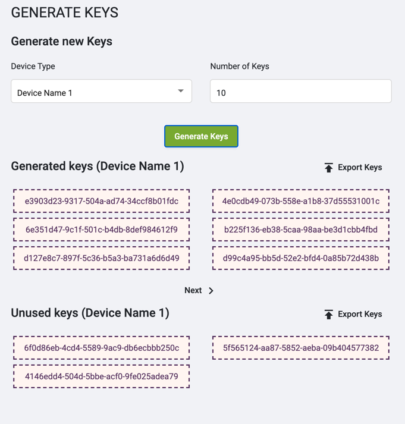
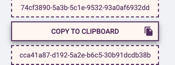
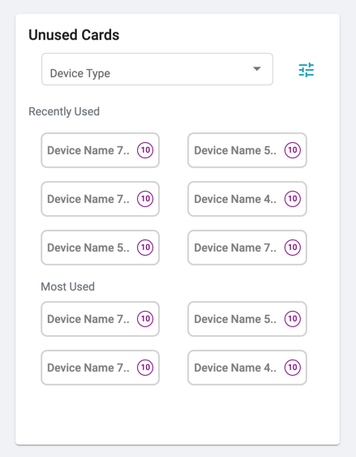
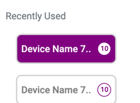
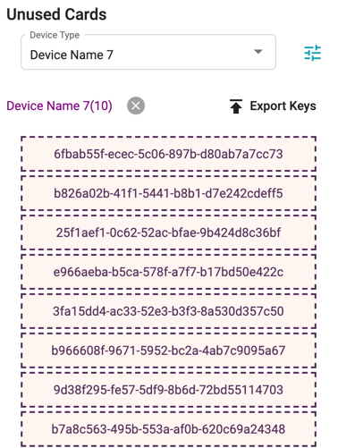
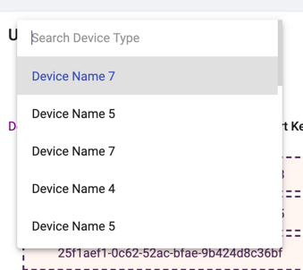

# Generate Keys

* The module will start by showing two components
1. Keys Generator
2. Unused Keys Card

* Select a Device Type use the search for select from large list of device types

* Enter Required number of keys to generate and click on generate keys

* Click on any key to copy it to clipboard

* A Snackbar will appear on successfully copying the key

## Unused Keys card

* On selecting any of the device

* The card will show the list of keys for that device

* Search and Select the device required 

* Same Clicking on the key in list will copy it to clipboard

