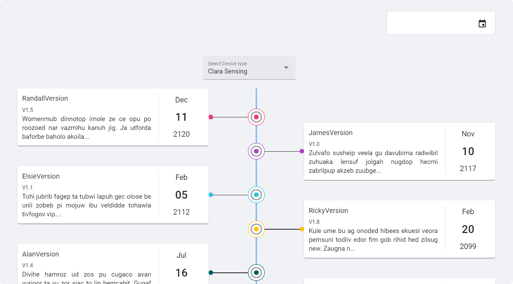

# OTA UPDATES

## Default View
### Overview:
As the project is about devices. Each device is associated with a device type and each device type has a set of Ota Updates.

### Features:
1. List of existing ota updates of a certain device type
      A. Displayed in the form of cards which are paginated inorder to view more.
      B. Displayed in the form of an OTA Timeline catogorised by device types. 
         It also gives a choice to filter the updates according to date, ota version, ota name and description.
         These updates are sorted with respect to date, the most recent updates are displayed at the top.
2. Add an ota update under a particular device type
    Inorder to add an ota update a form comprising of the below details must be filled.
    Fields to be filled:
      A. Ota name
      B. Device type
      C. Ota version
      D. Description
      E. A relevant file

## Time line view of OTA updates:

# Overview
It will display a list of OTA associated to a single device selected in the dropdown
in a timeline manner 

There is a date picker field to filter the timeline items based on date

On Selecting any device type from the dropdown the OTA updates list will change dynamically in real time
