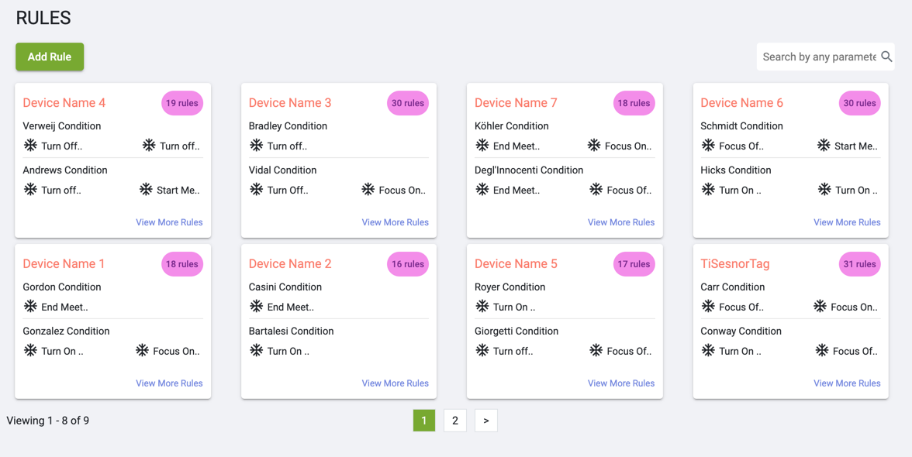
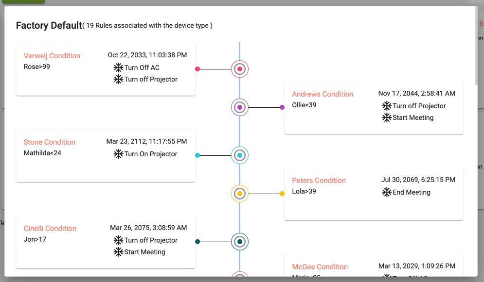
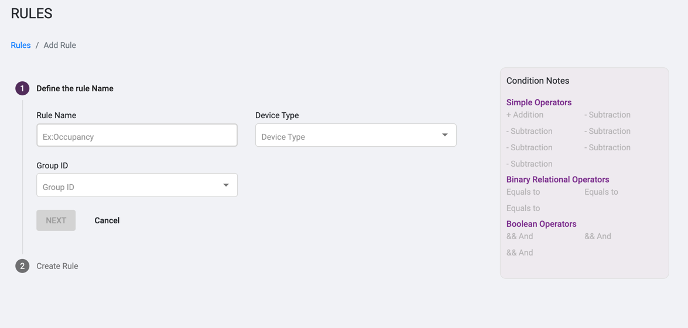
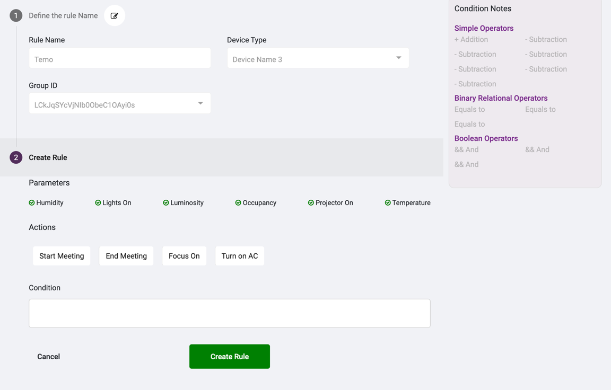

# Rules Module

* Rules Listing
All Rules are grouped based on device type and shown in a single card

* When clicked on view more rules  this popup will appear

showing all the rules and condition with the respective actions

* When cliked on add rule it will redirect to a form to fill up all the 
details for the rules

* Adding Paramentes and conditions to add a rule

* On Clicking on Create Rule it will hit an API call and reset the form to add another rule

